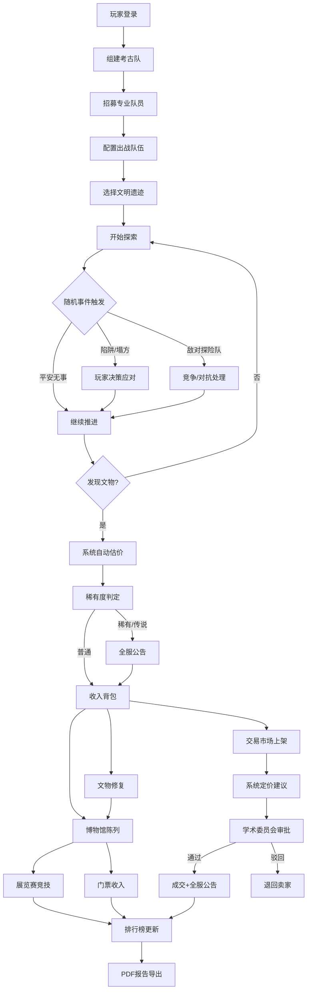

## 1. 产品概述

大型多人在线文明遗迹探索与考古竞赛系统，玩家组建专业考古队探索全球古文明遗迹，挖掘、修复、收藏、交易珍贵文物，建造私人博物馆参与展览竞技。

- 融合策略经营、卡牌收集、实时多人探索等玩法
- 目标用户：历史文化爱好者、策略游戏玩家、收藏爱好者
- 市场价值：填补考古主题多人在线游戏的空白，兼具教育性与娱乐性

## 2. 核心功能

### 2.1 用户角色

| 角色 | 注册方式 | 核心权限 |
|------|----------|----------|
| 普通玩家 | 游客/账号注册 | 组建队伍、探索遗迹、收藏文物、建造博物馆、参与交易、展览竞技 |
| 学术委员 | 系统遴选/玩家晋升 | 文物交易审批、异常交易核查、学术榜单评审 |

### 2.2 功能模块

1. **主页/总览**：玩家信息概览、全服公告、活动入口、快捷导航
2. **考古队管理**：队伍组建、队员招募、技能配置、幸运值管理
3. **遗迹探索**：文明遗迹地图、探索进度计算、随机事件触发、实时秘境探索
4. **文物系统**：文物发现、属性评估、全服公告、文物修复、碎片合成
5. **博物馆**：展馆建造、文物陈列、吸引力计算、门票收入、展览赛
6. **交易市场**：文物上架、智能定价建议、学术委员会审批、全服成交公告
7. **排行榜与报告**：全服考古榜、博物馆评分榜、PDF数据报告导出
8. **秘境遗迹**：每日限时开放、数百人同时探索、实时进度与事件广播

### 2.3 页面详情

| 页面名称 | 模块名称 | 功能描述 |
|----------|----------|----------|
| 主页总览 | 玩家状态栏 | 等级、金币、文物总值、博物馆评分实时展示 |
| 主页总览 | 全服公告栏 | 稀有文物发现、大额成交、展览赛结果滚动播报 |
| 主页总览 | 活动入口 | 秘境遗迹、每周展览赛、限时活动卡片 |
| 考古队管理 | 队员列表 | 探险家/语言学家/工程师等专业人员展示与管理 |
| 考古队管理 | 招募中心 | 不同稀有度队员招募池、技能属性预览 |
| 考古队管理 | 队伍配置 | 出战队伍选择、技能加成计算、幸运值总览 |
| 遗迹探索 | 文明地图 | 古埃及/玛雅/亚特兰蒂斯等遗迹选择、难度/奖励展示 |
| 遗迹探索 | 探索进度 | 实时进度条、队员技能影响因子、预计剩余时间 |
| 遗迹探索 | 事件面板 | 陷阱/塌方/敌对探险队等随机事件弹窗与选择分支 |
| 文物详情 | 文物卡片 | 完整度/稀有度/历史价值三维属性展示与3D预览 |
| 文物详情 | 估价系统 | 系统自动估价、历史成交对比、全服公告触发 |
| 文物修复 | 修复工坊 | 材料选择（碎片/粘合剂）、修复概率计算、结果动画 |
| 博物馆 | 展馆布局 | 展厅建造、展柜位置调整、文物拖拽摆放 |
| 博物馆 | 经营面板 | 吸引力计算、门票收入趋势、游客流量统计 |
| 展览赛 | 比赛大厅 | 每周赛事列表、对手匹配（综合评分）、报名入口 |
| 展览赛 | 实时对战 | 游客评价实时更新、文物受损风险提示、分数对比 |
| 交易市场 | 文物列表 | 上架文物浏览、筛选排序、价格区间标记 |
| 交易市场 | 上架定价 | 卖家定价、7天成交均价建议区间、手续费计算 |
| 交易市场 | 审批中心 | 学术委员会多层审核界面、走私风险评估、审批记录 |
| 排行榜 | 全服榜单 | 文物总值榜、博物馆评分榜、考古成就榜 |
| 排行榜 | 报告导出 | 遗址分布图、收入趋势图、PDF报告生成与下载 |
| 秘境遗迹 | 实时大厅 | 参与人数统计、队伍列表、倒计时入口 |
| 秘境遗迹 | 探索实况 | 数百队伍进度条、突发事件全服广播、奖励实时发放 |

## 3. 核心流程

### 3.1 主要用户流程

玩家注册后创建考古队，从招募中心招募不同专业队员（探险家提升探索速度、语言学家解读古文提升文物发现率、工程师处理陷阱与机械装置）。配置好队伍后选择目标文明遗迹开始探索，系统根据队伍技能配置自动计算探索进度。探索过程中随机触发陷阱、塌方、敌对探险队等事件，玩家需做出决策。挖掘到文物后系统自动评估完整度、稀有度、历史价值并计算估价，稀有文物触发全服公告。玩家可使用碎片、粘合剂等材料修复文物，修复成功提升品质，失败可能造成损坏。玩家建造博物馆，通过文物搭配和摆放策略提升吸引力与门票收入。每周参加展览赛，系统按综合评分匹配对手，实时显示游客评价和文物受损风险。玩家可在交易市场出售文物，系统根据近7天同类成交均价给出建议价格区间，成交后触发全服公告，并需经学术委员会多层审批以防走私。全服考古榜实时更新排名，玩家可导出含遗址分布图、收入趋势的PDF报告。每日开放秘境遗迹，数百玩家同时涌入探索，系统实时处理各队进度和突发事件。

### 3.2 核心流程图

## 4. 用户界面设计

### 4.1 设计风格

- **主色调**：深古铜色 #8B6914 作为主色，搭配砂金色 #D4AF37 点缀，背景使用暗棕色 #2C1810 营造考古氛围
- **辅助色**：遗迹绿 #4A7C59（代表探索）、沙岩黄 #C9A959（代表文物）、赤陶红 #A0522D（代表警示/事件）
- **按钮风格**：浮雕质感金属按钮，圆角8px，带微亮边框和内阴影，hover时有金粉闪烁效果
- **字体**：标题使用 Cinzel（古罗马风格衬线字体），正文使用 Cormorant Garamond（优雅衬线体），数据展示使用 JetBrains Mono
- **布局风格**：卡片式布局配合羊皮纸纹理背景，关键面板使用装饰性边框，整体呈现复古古籍美学
- **图标风格**：线性图标配合金箔质感填充，使用考古相关符号（古文字、卷轴、金字塔、文物器皿）

### 4.2 页面设计概览

| 页面名称 | 模块名称 | UI元素 |
|----------|----------|--------|
| 主页总览 | 整体布局 | 深色羊皮纸背景、古铜色装饰边框、左右分栏设计 |
| 主页总览 | 玩家状态栏 | 头像徽章、等级数字带罗马数字装饰、资源数值带动态闪烁效果 |
| 主页总览 | 全服公告栏 | 滚动文字面板、稀有事件金色高亮、新消息动画提示 |
| 考古队管理 | 队员卡片 | 圆形头像带职业光环、技能条渐变填充、幸运值星形评级 |
| 考古队管理 | 招募中心 | 神秘宝箱式卡片、翻开动画、稀有度光晕 |
| 遗迹探索 | 文明地图 | 立体浮雕式地图节点、连线发光动画、当前位置脉冲标记 |
| 遗迹探索 | 进度面板 | 羊皮纸卷动式进度条、分段里程碑、队员头像沿进度条分布 |
| 遗迹探索 | 事件弹窗 | 仿古卷轴展开动画、选项按钮带岁月痕迹质感、危险选项红色光晕 |
| 文物详情 | 文物卡片 | 3D旋转展示、属性雷达图、金色边框根据稀有度变化 |
| 文物修复 | 修复工坊 | 工作台视角、材料槽位拖拽、修复进度粒子动画 |
| 博物馆 | 展馆布局 | 俯视/透视切换、展柜拖拽、文物悬浮预览、吸引力热力图 |
| 博物馆 | 经营面板 | 收入趋势折线图（金色描边）、游客流量柱状图 |
| 展览赛 | 实时对战 | VS分屏对比、实时分数跳动动画、观众评价弹幕效果 |
| 交易市场 | 定价面板 | 价格区间滑块、7天均价曲线、建议范围绿色高亮 |
| 排行榜 | 榜单列表 | 前三名特殊奖杯样式、排名变化箭头动画、玩家头像墙 |
| 秘境遗迹 | 探索实况 | 多队伍进度条瀑布流、突发事件全屏横幅、奖励掉落粒子特效 |

### 4.3 响应式设计

- 桌面端优先设计（1920×1080基准）
- 平板端（≥768px）：左右分栏改为上下堆叠，侧边栏改为抽屉式
- 移动端（<768px）：卡片单列排列，复杂图表简化展示，触摸按钮放大至48×48px
- 所有交互动画支持降级，保证低端设备流畅运行

### 4.4 视觉动效

- 页面加载：古书翻页式过场动画
- 文物发现：金光炸裂+粒子迸射+慢动作展示
- 稀有公告：全屏金色横幅从顶部滑落，伴随古钟音效
- 探索进度：流沙填充效果，里程碑点亮时有符文闪光
- 博物馆吸引力：文物周围浮现淡金色光晕，游客小人模型行走动画
