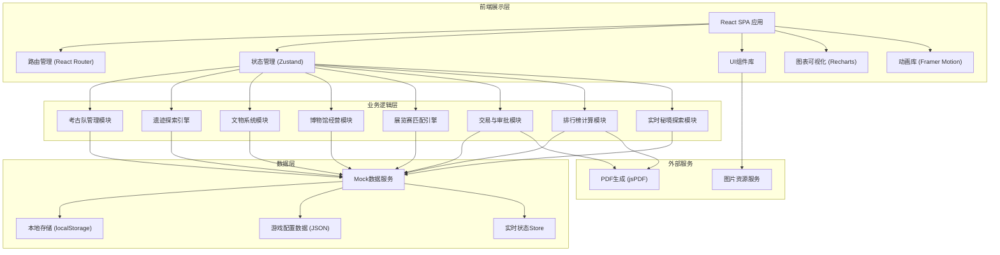
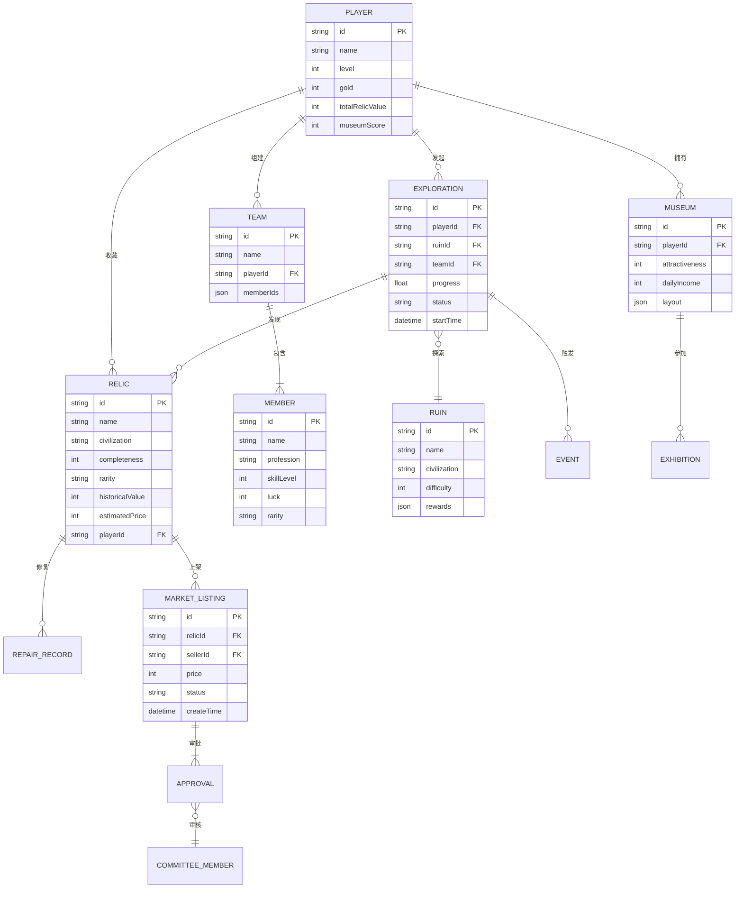

## 1. 架构设计



## 2. 技术描述

- **前端框架**：React@18 + TypeScript
- **构建工具**：Vite@5
- **样式方案**：TailwindCSS@3 + PostCSS
- **状态管理**：Zustand（轻量级状态管理，支持中间件持久化）
- **路由**：React Router@6
- **图表可视化**：Recharts（收入趋势、排行榜、分布图）
- **动画效果**：Framer Motion（页面过渡、文物发现、事件弹窗动画）
- **图标**：Lucide React（配合自定义装饰风格）
- **PDF导出**：jsPDF + html2canvas
- **后端**：无后端，使用Mock数据 + localStorage持久化模拟多人在线效果
- **数据持久化**：localStorage存储玩家数据、探索进度、文物收藏

## 3. 路由定义

| 路由 | 页面 | 用途 |
|------|------|------|
| / | 主页总览 | 玩家信息、全服公告、活动入口、快捷导航 |
| /team | 考古队管理 | 队员列表、招募中心、队伍配置 |
| /explore | 遗迹探索 | 文明地图、探索进度、随机事件 |
| /relics | 文物收藏 | 文物背包、文物详情、修复工坊 |
| /museum | 博物馆 | 展馆布局、经营面板、展览赛 |
| /market | 交易市场 | 文物列表、上架定价、审批中心 |
| /ranking | 排行榜 | 全服榜单、报告导出 |
| /secret | 秘境遗迹 | 实时大厅、探索实况 |

## 4. 数据模型

### 4.1 ER图



### 4.2 核心数据结构定义

```typescript
// 玩家
interface Player {
  id: string;
  name: string;
  avatar: string;
  level: number;
  exp: number;
  gold: number;
  gems: number;
  totalRelicValue: number;
  museumScore: number;
}

// 队员职业
type Profession = 'explorer' | 'linguist' | 'engineer' | 'archaeologist' | 'historian';
type Rarity = 'common' | 'rare' | 'epic' | 'legendary';

// 队员
interface TeamMember {
  id: string;
  name: string;
  profession: Profession;
  skillLevel: number;
  luck: number;
  rarity: Rarity;
  avatar: string;
  skills: {
    explorationSpeed: number;
    relicDiscovery: number;
    trapHandling: number;
    repairBonus: number;
  };
}

// 考古队
interface Team {
  id: string;
  name: string;
  memberIds: string[];
  active: boolean;
}

// 文明遗迹
type Civilization = 'egypt' | 'maya' | 'atlantis' | 'rome' | 'china' | 'mesopotamia';

interface Ruin {
  id: string;
  name: string;
  civilization: Civilization;
  difficulty: number;
  description: string;
  image: string;
  minLevel: number;
  estimatedTime: number;
  potentialRelics: string[];
  eventPool: string[];
}

// 探索记录
interface Exploration {
  id: string;
  playerId: string;
  ruinId: string;
  teamId: string;
  progress: number;
  status: 'exploring' | 'completed' | 'failed' | 'paused';
  startTime: number;
  eventsTriggered: ExplorationEvent[];
  relicsFound: string[];
}

// 探索事件
interface ExplorationEvent {
  id: string;
  type: 'trap' | 'collapse' | 'rival' | 'treasure' | 'discovery';
  title: string;
  description: string;
  choices: EventChoice[];
  resolved: boolean;
  result?: EventResult;
}

interface EventChoice {
  id: string;
  text: string;
  requiredSkill?: { profession: Profession; minLevel: number };
  successRate: number;
}

interface EventResult {
  success: boolean;
  message: string;
  effects: {
    progressChange?: number;
    goldChange?: number;
    luckChange?: number;
    damage?: boolean;
  };
}

// 文物
interface Relic {
  id: string;
  name: string;
  civilization: Civilization;
  completeness: number;
  rarity: Rarity;
  historicalValue: number;
  estimatedPrice: number;
  currentPrice: number;
  description: string;
  image: string;
  fragments: number;
  discoveredAt: number;
  repairHistory: RepairRecord[];
}

// 修复记录
interface RepairRecord {
  id: string;
  timestamp: number;
  success: boolean;
  materialsUsed: { type: string; quality: number; amount: number }[];
  completenessBefore: number;
  completenessAfter: number;
}

// 博物馆
interface Museum {
  id: string;
  playerId: string;
  name: string;
  level: number;
  attractiveness: number;
  dailyIncome: number;
  totalVisitors: number;
  halls: MuseumHall[];
  layout: LayoutSlot[][];
}

interface MuseumHall {
  id: string;
  name: string;
  theme: Civilization | 'mixed';
  capacity: number;
  displayedRelics: string[];
  bonusMultiplier: number;
}

interface LayoutSlot {
  type: 'empty' | 'display' | 'decoration' | 'path';
  relicId?: string;
  decorationId?: string;
}

// 展览赛
interface Exhibition {
  id: string;
  week: number;
  status: 'upcoming' | 'ongoing' | 'completed';
  participants: ExhibitionParticipant[];
  matches: ExhibitionMatch[];
}

interface ExhibitionParticipant {
  playerId: string;
  museumScore: number;
  relics: string[];
}

interface ExhibitionMatch {
  id: string;
  participantA: string;
  participantB: string;
  scoreA: number;
  scoreB: number;
  visitorReviews: VisitorReview[];
  damageRisk: number;
  status: 'pending' | 'ongoing' | 'finished';
  winner?: string;
}

interface VisitorReview {
  id: string;
  timestamp: number;
  rating: number;
  comment: string;
  target: 'A' | 'B';
}

// 交易市场
interface MarketListing {
  id: string;
  relicId: string;
  sellerId: string;
  sellerName: string;
  price: number;
  suggestedPriceMin: number;
  suggestedPriceMax: number;
  status: 'pending_approval' | 'listed' | 'sold' | 'rejected' | 'expired';
  createTime: number;
  approvals: ApprovalRecord[];
  priceHistory: { time: number; price: number }[];
}

interface ApprovalRecord {
  id: string;
  approverId: string;
  approverName: string;
  level: 1 | 2 | 3;
  decision: 'approved' | 'rejected' | 'pending';
  comment?: string;
  timestamp: number;
  riskAssessment: 'low' | 'medium' | 'high';
}

// 排行榜
interface RankingEntry {
  rank: number;
  playerId: string;
  playerName: string;
  avatar: string;
  value: number;
  change: number;
}

// 秘境遗迹
interface SecretRealm {
  id: string;
  name: string;
  openTime: number;
  closeTime: number;
  maxPlayers: number;
  currentPlayers: number;
  teams: SecretRealmTeam[];
  globalEvents: GlobalEvent[];
}

interface SecretRealmTeam {
  teamId: string;
  playerId: string;
  playerName: string;
  progress: number;
  position: number;
  events: ExplorationEvent[];
  relicsFound: number;
}

interface GlobalEvent {
  id: string;
  timestamp: number;
  type: 'broadcast' | 'boss' | 'treasure_horde';
  message: string;
  affectedTeams?: string[];
}
```

## 5. 核心算法设计

### 5.1 探索进度计算

```
探索速度 = 基础速度 × (1 + Σ队员探索速度加成) × 幸运修正
其中:
- 基础速度 = 100 / 遗迹预计时间(秒)
- 探险家探索速度加成 = (skillLevel × 0.02)
- 工程师陷阱处理 = 减少减速事件概率
- 幸运修正 = 0.8 + (队伍平均幸运值 / 200)
```

### 5.2 文物发现概率

```
文物发现率 = 基础发现率 × (1 + 语言学家技能加成) × (1 + 历史学家技能加成) × 稀有度权重
基础发现率每进度百分比 = 0.5% ~ 2% (根据遗迹难度)
稀有度权重:
- 普通: 70%
- 稀有: 20%  
- 史诗: 8%
- 传说: 2%
```

### 5.3 文物估价算法

```
估价 = 基础价值 × 完整度系数 × 稀有度系数 × 历史价值系数
其中:
- 基础价值 = 根据文明类型和文物种类查表
- 完整度系数 = completeness / 100 (0~1)
- 稀有度系数: 普通=1, 稀有=3, 史诗=10, 传说=50
- 历史价值系数 = 0.5 + (historicalValue / 200)
```

### 5.4 修复成功率

```
修复成功率 = 基础成功率 + 材料品质加成 + 队员技能加成
其中:
- 基础成功率 = (当前完整度 / 100) × 0.6
- 材料品质加成 = Σ(材料品质 × 材料数量) × 0.02
- 队员技能加成 = max(工程师修复加成, 考古学家修复加成)
失败惩罚: 完整度降低 5~15 点
```

### 5.5 博物馆吸引力计算

```
吸引力 = Σ(文物吸引力 × 位置加成 × 主题协同加成) × 展馆等级系数
其中:
- 文物吸引力 = (稀有度系数 × 完整度 × 历史价值) / 100
- 位置加成 = 中心位1.3, 主位1.1, 普通位1.0
- 主题协同 = 同文明陈列 +15%/件
- 展馆等级系数 = 1 + (level - 1) × 0.1
门票收入 = 吸引力 × 基础票价 × 游客流量系数
```

### 5.6 交易定价建议

```
建议区间 = [7日均价 × 0.85, 7日均价 × 1.15]
7日均价 = Σ(近7天同类成交价格) / 成交数量
同类定义 = 相同文明 + 相同稀有度 + 相同完整度区间(±10%)
走私风险评估 = f(价格偏离度, 卖家历史记录, 文物稀有度)
```

## 6. 项目目录结构

```
src/
├── assets/              # 静态资源
│   ├── fonts/           # 字体文件
│   ├── images/          # 图片资源
│   └── styles/          # 全局样式
├── components/          # 公共组件
│   ├── ui/              # 基础UI组件
│   ├── layout/          # 布局组件
│   └── shared/          # 业务共享组件
├── pages/               # 页面组件
│   ├── Home/            # 主页总览
│   ├── Team/            # 考古队管理
│   ├── Explore/         # 遗迹探索
│   ├── Relics/          # 文物收藏
│   ├── Museum/          # 博物馆
│   ├── Market/          # 交易市场
│   ├── Ranking/         # 排行榜
│   └── SecretRealm/     # 秘境遗迹
├── store/               # 状态管理
│   ├── playerStore.ts
│   ├── teamStore.ts
│   ├── explorationStore.ts
│   ├── relicStore.ts
│   ├── museumStore.ts
│   ├── marketStore.ts
│   └── secretRealmStore.ts
├── data/                # Mock数据与配置
│   ├── members.ts       # 队员数据
│   ├── ruins.ts         # 遗迹数据
│   ├── relics.ts        # 文物模板
│   ├── events.ts        # 事件池
│   └── config.ts        # 游戏配置
├── utils/               # 工具函数
│   ├── calculators/     # 各种算法计算
│   ├── generators/      # 随机生成器
│   ├── pdf.ts           # PDF导出
│   └── helpers.ts       # 通用辅助
├── types/               # TypeScript类型定义
│   └── index.ts
├── hooks/               # 自定义Hooks
├── router/              # 路由配置
├── App.tsx
└── main.tsx
```
